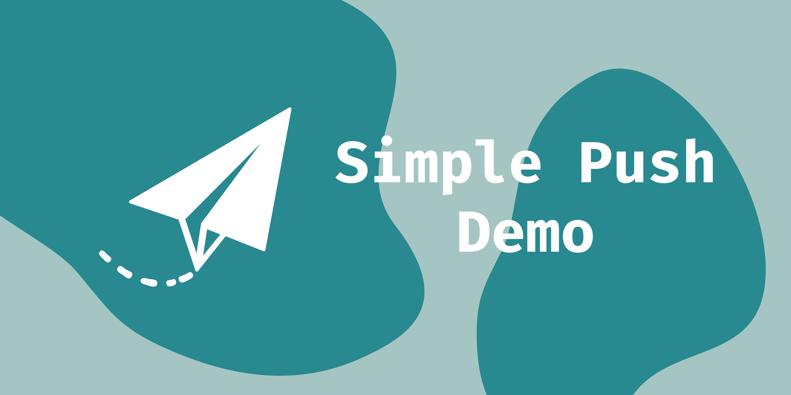

# Simple Push Demo

The goal of this repo is to demonstrate how to implement push
notifications into your web app.

## Relevant Docs Information

- [Server Side Libraries to Help Send Push Messages ](https://github.com/web-push-libs/)
- [Blog Post on Encrypting Payload Data](https://developers.google.com/web/updates/2016/03/web-push-encryption)
- [Blog Post on VAPID](https://developers.google.com/web/updates/2016/07/web-push-interop-wins)
- [Web Push Book](https://web-push-book.gauntface.com)

## Using the Demo Locally

To try out the demo locally, clone the repo and run the following:

1. Install the required NPM modules for building the project

        npm install

1. Run dev server

        make dev

## Building the Demo

To build the site in preparation for deployment run `make build`.